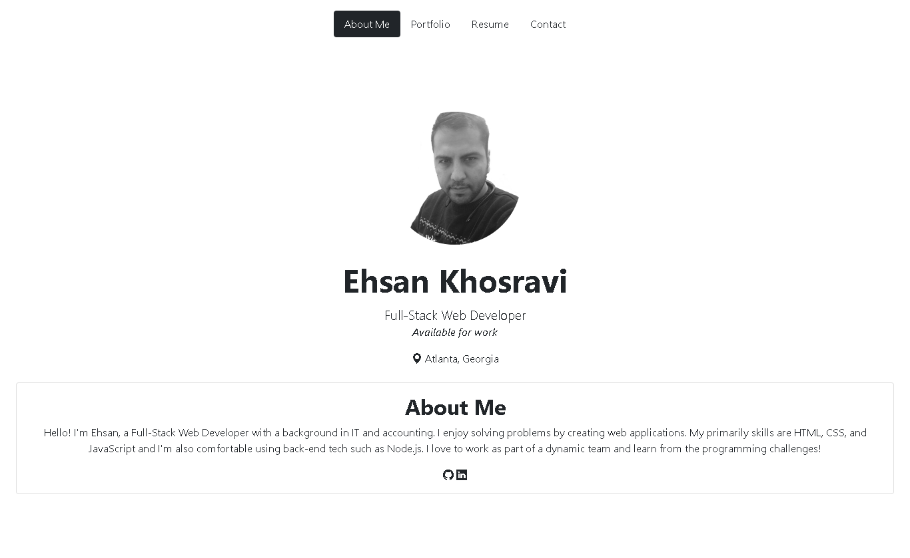

# Ehsan Khosravi Portfolio

Hello! I'm Ehsan, a Full-Stack Web Developer with a background in IT and accounting. I enjoy solving problems by creating web applications. My primarily skills are HTML, CSS, and JavaScript and I'm also comfortable using back-end tech such as Node.js. I love to work as part of a dynamic team and learn from the programming challenges!

### Built With

- [HTML](https://developer.mozilla.org/en-US/docs/Web/HTML)
- [CSS](https://developer.mozilla.org/en-US/docs/Web/CSS)
- [Bootstrap](https://getbootstrap.com/)

## Links

- [Project Link](https://github.com/ekhosr/myPortfolio)
- [Deployed Application](https://ekhosr.github.io/myPortfolio/)
